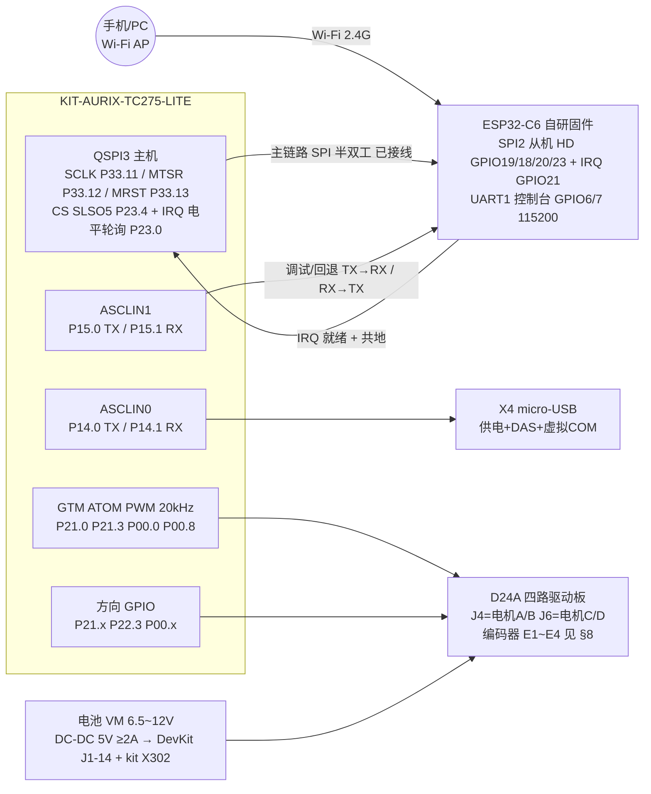

# AURIX SmartDrive 接线图（TC275 + ESP32-C6 + D24A 四路驱动板）

> 文档编号 **23** · 域 设计·硬件 · 定位：**引脚与接线真源**（脚位/孔位冲突以本文为准） · 上级索引 [00-index.md](../00-index.md)

版本：V1.5（2026-09-26：**TC275 侧 SPI 链路代码落地**（`Middleware/com/`、`Middleware/sf/`），P23.0 握手改为**电平轮询**（P23.x 无法产生边沿中断，见 22 号文档 E11），构建默认仍是 UART、SPI 用 `-D USE_SPI_LINK` 开启；V1.4 已按 §9.1 完成 SPI 实物接线；V1.3 已把 §9 定为主链路、§2 UART 降级为调试控制台/回退链路；驱动板为轮趣 D24A 四路稳压模块，按原理图 REV1.0 核对）

配套文档：11-requirements.md（产品需求 V1.2）、[21-software-design.md](../20-design/21-software-design.md)（量产 SDD V1.2，**设计基准**）、[22-link-spi-design.md](../20-design/22-link-spi-design.md)（SPI 链路详细设计）

ESP32-C6 固件工程：**自研** `C:\Code\TC275\AURIX-v1.10.36-workspace\c6_car`（ESP-IDF）；`esp-at` 工程仅作 UART 回退参考

ESP32-C6 硬件板卡：**ESP32-C6-DevKitC-1 V1.2**（ESP32-C6-WROOM-1/-1U 模组，8 MB flash，板载 5V→3.3V LDO、USB-UART 桥 + 原生 USB 双 Type-C 口、BOOT/RST 按键、GPIO8 地址彩灯）

参考资料：[ESP32-C6-DevKitC-1 v1.2 User Guide](https://docs.espressif.com/projects/esp-dev-kits/en/latest/esp32c6/esp32-c6-devkitc-1/user_guide.html)

---

## 1. 系统总接线图

**接线状态一览（2026-09-26）**

| 通道 | 见 | 实物状态 |
|---|---|---|
| **板间主链路 SPI**（QSPI3 主 ↔ C6 SPI2 从 + IRQ，5 线 + 共地） | §9.1 | ✅ **已按 §9.1 完成接线**。**两侧固件均已实现**：C6 侧 = `c6_car` `22e15f2`（`spi_slave_hd` 从机，已提交）；TC275 侧 = `Middleware/com/` + `Middleware/sf/`（默认关闭，`-D USE_SPI_LINK` 开启）。下一步：一次 IDE 构建确认链接闭合 + G1 波形门禁 |
| 板间调试/回退 UART（ASCLIN1 ↔ GPIO6/7） | §2 | ✅ 已接，保留（C6 控制台 + 回退通道） |
| 电机 PWM/方向 8 线 + STBY | §3 / §4 | ✅ 已接，实车验证 |
| 编码器 8 线（P33.0~7 / X2-28~35） | §8.2 | ⏳ 方案定稿，**待确认后再接线** |
| 电源与共地 | §5 | ✅ 已接 |

```
                        ┌──────────────────────────────────┐
                        │       KIT-AURIX-TC275-LITE       │
  X4 micro-USB ────────►│  供电 + DAS 调试 + 虚拟 COM       │
  (接PC, 一根线三件事)   │  ASCLIN0 P14.0/P14.1 板内互连     │
                        │                                  │
  ESP32-C6-DevKitC-1    │ ══ 主链路 QSPI3 主机（§9.1 已接）══│
  ┌─────────────────┐   │                                  │
  │ GPIO19 SCLK ◄───────│─ P33.11  SCLK   X1-3   主→从      │
  │ GPIO18 MOSI ◄───────│─ P33.12  MTSR   X1-4   主→从      │
  │ GPIO20 MISO ───────►│─ P33.13  MRST   X1-5   从→主      │
  │ GPIO23 CS   ◄───────│─ P23.4   SLSO5  X1-12  主→从      │
  │ GPIO21 IRQ  ───────►│─ P23.0   电平   X1-8   从→主      │
  │  ····· GND ─────────│─ GND     共地（必须！）            │
  │                     │                                  │
  │ 调试/回退 UART（§2）│ ══ ASCLIN1（mikroBUS 13/14）══════ │
  │ GPIO7 TX  ─────────►│─ P15.1   RX                      │
  │ GPIO6 RX  ◄─────────│─ P15.0   TX                      │
  │ 5V ◄── DC-DC 5V≥2A  │  (板载 LDO 出 3.3V, 见 §5)        │
  │ EN/RST 板载已处理    │                                  │
  └─────────────────┘   │  GTM PWM 20kHz    方向 GPIO       │
                        │  P21.0 P21.3      P21.2~5         │
     电池(2S~3S)         │  P00.0 P00.8      P00.x P22.3     │
        │               └──────────┬────────────────────────┘
        ├──► VM(→D24A VIN) ───────►│
        ├──► DC-DC 降压 5V ≥2A ──► 5V(DevKit J1-14) + kit X302
        │                        ┌────────────────────┐
        └──► GND(全系统共地)      │ D24A 四路驱动板     │
                                 │ J4: A=电机A B=电机B│── AO/BO → 同侧两轮电机
                                 │ J6: A=电机C B=电机D│── CO/DO → 另一侧两轮电机
                                 └────────────────────┘   (编码器 E1~E4 见 §8)
```

Mermaid 版（支持的查看器可渲染）：



> **V1.5 现状标注**：`QSPI3 ↔ C6 SPI2`（§9.1 五线 + 共地）**已按接线表完成实物接线**；`ASCLIN1 ↔ GPIO6/7` UART 线**保留不拆**，仅作 C6 调试控制台与回退通道。**两侧 SPI 固件代码均已落地**：C6 侧 `c6_car` 已完成 `spi_slave_hd` 从机改造（提交 `22e15f2`，UART 时代的 0x44 波特率协商与 `C6_LINK_TX/RX_GPIO` 已删除）；TC275 侧代码已就位但**构建默认仍是 UART**，SPI 需 `-D USE_SPI_LINK` 显式开启。**通电联调尚未做过**：链路启用与波形兼容性由 G1 门禁把关（见 [22-link-spi-design.md](../20-design/22-link-spi-design.md) §8）。编码器 8 线见 §8（尚未接线，待确认）。

---

## 2. TC275 ↔ ESP32-C6（UART 通道：V1.3 起降级为调试控制台 / 回退链路）

> **状态变更（V1.3）**：本节描述的 ASCLIN1 ↔ C6 UART 接线**保留不拆**，用途改为 ①C6 自研固件的 115200 调试控制台，②SPI 主链路（§9）波形兼容验证（G1）失败时的回退通道。引脚与流控信息仍按 esp-at 时代记录，供返工查阅。
>
> **已消除的不一致（V1.5 核对）**：`c6_car/components/c6_link/Kconfig` 原 `C6_LINK_TX_GPIO default 10` / `C6_LINK_RX_GPIO default 11` 与本节记录的 **GPIO6(RX)/GPIO7(TX)** 冲突。C6 侧 SPI 改造（提交 `22e15f2`）时**已删除**这两项，改为显式的 `C6_LINK_DEBUG_UART_RX_GPIO default 6` / `C6_LINK_DEBUG_UART_TX_GPIO default 7`，与本节和实物接线一致。UART 通道现在只剩调试控制台用途。

ESP32-C6 esp-at 固件的 AT 通道是 **UART1**（不是 ESP8266 的 UART0），默认引脚如下（来自 esp-at `docs/en/Get_Started/Hardware_connection.rst` ESP32-C6 章节）。DevKitC-1 排针位置见官方 User Guide 引脚图（引脚号以板端丝印为准）：

| TC275 (LITE kit) | 方向 | ESP32-C6 (esp-at) | DevKitC-1 位置 | 说明 |
|---|---|---|---|---|
| P15.0（ASCLIN1 TX） | → | GPIO6（UART1 RX） | J1-5 | 交叉连接 |
| P15.1（ASCLIN1 RX，保持上拉） | ← | GPIO7（UART1 TX） | J1-6 | 交叉连接 |
| GND | — | GND | J1-15 | **必须共地** |
| — | — | 5V 供电 | J1-14（5V） | 车载 DC-DC 5V（与 kit 共用 ≥2A 轨），见 §5 |

> AT 串口用 ASCLIN1：TX=**P15.0**、RX=**P15.1**（iLLD 符号 `IfxAsclin1_TX_P15_0_OUT` / `IfxAsclin1_RXA_P15_1_IN`）。物理位置在板载 **mikroBUS 插座：pin13=TX(P15.0)、pin14=RX(P15.1)**（官方手册 Figure 5，二者不在 X1/X2 上）。曾在 V1.1 尝试改用 P11.12/P11.10（X1-32/34），联调无 RX 响应，已改回 P15.0/P15.1。注意 X1 上印着 `RXD1/TXD0` 的 P11.9/P11.3 是片上以太网 MII 信号，**不是**串口，勿混用；P11.10 还是 Shield2Go 2 的 CS 复用位，插 S2G 板时会冲突。

> J1-1 的 3V3 是板载 LDO 的**输出**脚：采用 5V 供电方案时请勿再从外部向 3V3 灌电。

可选 / 流控：

| TC275 | 方向 | ESP32-C6 (esp-at) | DevKitC-1 位置 | 说明 |
|---|---|---|---|---|
| （可不接） | ← | GPIO4（UART1 RTS） | J1-3 | esp-at 默认 RTS 流控开启，处理方式见下 |
| （可不接） | → | GPIO5（UART1 CTS） | J1-4 | |

> **流控注意**：`module_esp32c6_default` 的 `CONFIG_AT_UART_DEFAULT_FLOW_CONTROL=1`（RTS 使能）。两种解决办法任选其一：
> 1. TC275 初始化 AT 序列最前面补发 `AT+UART_CUR=115200,8,1,0,0`（关流控，运行时生效）；
> 2. 在 esp-at 编译时将该配置改为 0（编译期生效）。
> 若不处理，ESP32-C6 接收缓冲接近满时会通过 RTS 停发，而 TC275 不检查该信号，极端情况下会丢字节。

烧录 / 日志：**无需外接 USB-UART 线**。DevKitC-1 V1.2 板载两个 Type-C 口：

| 接口 | 内部连接 | 用途 |
|---|---|---|
| USB-to-UART 桥口 | 桥接芯片 → UART0（GPIO16/17），支持自动下载 | 烧录（`idf.py flash` / esptool）、esp-at 日志 |
| ESP32-C6 USB 口 | 原生 USB（D+=GPIO13、D-=GPIO12，经 J3） | USB-Serial-JTAG 烧录/控制台 |

手动进下载模式：按住 BOOT（GPIO9）→ 点按 RST → 松开 BOOT。正常运行时 GPIO9/GPIO8 保持板载状态即可。

板载资源速查（避免误用）：

| 板载器件 | 占用引脚 | 本项目注意事项 |
|---|---|---|
| BOOT 按键 | GPIO9（strapping） | 不接外部电路；上电为低会进下载模式 |
| 地址彩灯 | GPIO8（strapping） | 已占用，勿作普通 IO、勿外接下拉 |
| RST 按键 / RST 脚 | EN（J1-2） | 可选：后续由 TC275 GPIO 引出做硬件复位/急停扩展 |
| J5 电流测量跳线 | 3V3 供电路径 | 用板载 LDO 给模组供电时保持短接 |
| USB 选择 J3 | GPIO12/13 | 使用原生 USB 口时保持默认连接 |

---

## 3. TC275 ↔ D24A 控制接线（J4 = 电机 A/B，同侧两轮；代码 motor.c）

驱动板为轮趣 **D24A**（双 TB6612 四通道 + 板载稳压，原理图 REV1.0 2023-03-21）：逻辑供电**板载自产**（VIN→5V/3V3，无需外接 VCC）；控制排针 **J4**（电机 A/B + STBY + 3V3 + 编码器 E1/E2）、**J6**（电机 C/D + 编码器 E3/E4 + ADC 电池分压）。

| D24A 信号 | J4 脚 | TC275 引脚 | X1 脚位 | 功能 |
|---|---|---|---|---|
| PWMA | J4-4 | P21.0 | X1-15 | 电机A PWM，20 kHz（ATOM2_4/TOUT51）|
| AIN1 | J4-8 | P21.4 | X1-19 | 电机A 方向 1 |
| AIN2 | J4-6 | P21.5 | X1-22 | 电机A 方向 2 |
| PWMB | J4-3 | P21.3 | X1-20 | 电机B PWM，20 kHz（ATOM4_1/TOUT54）|
| BIN1 | J4-7 | P21.2 | X1-17 | 电机B 方向 1 |
| BIN2 | J4-5 | P22.3 | X1-18 | 电机B 方向 2 |
| STBY | J4-2 | 跳线到 J4-1（板载 3V3）| — | 常使能，同座相邻脚直接短接 |
| 3V3 | J4-1 | —（本地）| — | 编码器参考电平/逻辑，勿外部灌电 |

电机 A/B 线圈接 D24A 对应电机座的 AO1/AO2、BO1/BO2。

> **X1 丝印复用说明（已核对，无冲突）**：X1-17（MDC）、X1-18（SCLK）、X1-20（MDIO）丝印是 TC275 **片上以太网 ESC** 的 MII 复用位置，板上**无外部驱动电路**，作电机线安全（实车已验证）。

## 4. TC275 ↔ D24A 控制接线（J6 = 电机 C/D，另一侧两轮）

| D24A 信号 | J6 脚 | TC275 引脚 | X2 脚位 | 功能 |
|---|---|---|---|---|
| PWMC | J6-4 | P00.0 | X2-3 | 电机C PWM，20 kHz（ATOM1_0/TOUT9）|
| CIN1 | J6-8 | P00.2 | X2-5 | 电机C 方向 1 |
| CIN2 | J6-6 | P00.6 | X2-7 | 电机C 方向 2（兼驱动板载 **LED2**）|
| PWMD | J6-3 | P00.8 | X2-9 | 电机D PWM，20 kHz（ATOM0_7/TOUT17）|
| DIN1 | J6-7 | P00.10 | X2-11 | 电机D 方向 1 |
| DIN2 | J6-5 | P00.12 | X2-13 | 电机D 方向 2 |
| ADC | J6-1 | —（备用）| — | 电池电压分压输出，可接 AN 脚做低压遥测 |

> **⚠ P00.0 双重身份（本次核对新发现）**：X2-3 丝印 `TXDCAN`——P00.0 同时接在板载 CAN 收发器 TLE9251 的 TXD 输入上。它现在是电机 C 的 PWM 输出：电气上是"输出→输入"并联，**不影响电机运行**，但板载 CAN 连接器会随 PWM 发出随机帧——**运行期间不要将外部 CAN 总线/设备接入板载 CAN 口**（也解释了为何该脚未被 iLLD ETH/CAN 示例占用）。X2-4（RXDCAN，收发器输出）未被工程使用，勿作普通输入用。
>
> **P00.6 兼 LED2**：电机 C 方向 2 翻转时板载 LED2 会亮/灭，属预期现象（输出同时驱动板载 LED 与 J6-6），无需处理。

> 电机 B、C 在软件中做了方向翻转（motor.c `g_dirInvert`），接线按本表即可，无需交换电机线。

## 5. 电源与接地

### 5.1 整车供电架构

```
电池(2S~3S, D24A VIN 建议 6.5~12V)
 ├──► D24A VIN（电机电源，粗线；逻辑 5V/3V3 由 D24A 板载稳压自产）
 ├──► DC-DC 降压 5V ≥2A ──┬──► TC275 LITE kit  X302(+5V)（见 §5.2）
 │                        └──► ESP32-C6-DevKitC-1 J1-14(5V)
 │                              └─ 板载 5V→3.3V LDO 给模组供电（J5 跳线保持短接）
 └──► GND（全系统共地）
```

### 5.2 TC275 LITE kit 供电详解（依据官方 User Manual V1.1 §2.1）

板载电源结构：输入 5V → **LDO G1** 产生 3.3V（板上称 **VEXT**，最大输出 1A）；绿色电源指示灯 **D5** 亮表示 3.3V 正常。另有一路 **VDD_USB**（X4 的 VBUS）。

官方提供 4 种供电方式，**同一时刻只允许一种**：

| 方式 | 入口 | 说明 |
|---|---|---|
| ① USB（桌面推荐） | **X4 micro-AB USB** 接 PC | 同时完成供电 + DAS 调试 + ASCLIN0 虚拟串口；USB2.0 口最多 500 mA，建议用 USB3.0 口（900 mA）或带高电流供电能力的外部 USB 电源 |
| ② 车载 5V（本项目采用） | **X302 Arduino 电源排针的 +5V 脚** | 来自 DC-DC 5V ≥2A（与 C6 共用一路） |
| ③ 车载 5V（备用入口） | **X1-39 或 X2-2 的 VDD_USB 脚** | 与 ② 等效 |
| ④ 外部 3.3V 直灌（特殊场景） | **X1-2 / X2-39 的 VEXT 脚** 或 X302 +3V3 脚 | 必须先**拆掉电阻 R27**（0Ω，0805）；副作用：**CAN 收发器失效**（TLE9251 需要 5V）。本项目不用 |

硬性警告（手册原文要点）：

- **X4 插着 USB 时，禁止**再从 ②③④ 任何电源脚输入电压——板上**没有反向电流保护**，会倒灌损坏 USB 主机/PC；反过来用车载 5V 上电时，也不要再把 X4 接到 PC（调试时拔掉 X4 或只保证二者不同时带电，DAS 调试需 X4 时须先断开车载 5V 的判断交给使用者，官方明确要求“ensure X4 is not supplied by any power source or PC”用于方式②③④）。
- 禁止多个电源脚同时施加电源，否则可能烧毁板子。
- **VEXT 就是 LDO G1 的输出轨**：向其灌电压会直接损坏 LDO（方式④拆 R27 是唯一合法例外）。
- 板卡逻辑电平为 **3.3V，不兼容 5V 电平外设**（官方手册 §3.3 明确）。

电流预算（LDO G1 上限 1A）：

| 负载 | 典型电流 |
|---|---|
| TC275 + FT2232（板载） | ~200–300 mA |
| ~~TB6612 逻辑 VCC~~ | D24A 板载稳压自供，**不再从 kit 取**（历史方案，仅当外接裸 TB6612 模块时才需 X1-2 VEXT 供逻辑） |
| 余量给扩展（编码器上拉参考等） | ~700 mA |

> 结论：**电机功率一律走 D24A VIN**，绝不允许从 kit 3.3V 轨取；ESP32-C6 **不要**从 kit 取电（它自己 5V→板载 LDO 独立供电），避免把 C6 的开关噪声和 1A 预算冲突压到 LDO G1 上。

### 5.3 ESP32-C6-DevKitC-1 供电要点

- 推荐从车载 DC-DC 的 **5V** 接入 J1-14（单板最低 ≥1A；与 TC275 kit 共用一路时整轨 ≥2A，见 §5.1），由板载 LDO 产生 3.3V 供模组；Wi-Fi 发射瞬时电流峰值 ~350–500 mA，5V 轨裕量不足会导致 Brownout 复位。
- 5V 入水口旁加 **≥470 µF 大电容 + 0.1 µF**；远离电机驱动走线，星型接地，避免电机电流纹波耦合。
- 也可用独立 3.3V ≥1A LDO 接 J1-1(3V3)，但此时须断开板载 LDO 供电路径（拔 J5 跳线），二选一，**禁止两路 3.3V 并联通电**。
- 调试阶段可临时用 PC USB 给 DevKitC-1 供电，但电机全速运行时 USB 供电电流不足，必须切换为车载 5V。

### 5.4 接地与上电顺序

```
全系统共地：电池负极 = D24A GND = kit X1-40/X2-40(GND) = DevKitC-1 GND(J1-15)
上电顺序：先整车 DC-DC 5V（逻辑上电）→ 电池 VIN（动力）；断电顺序相反。
电机线、编码器线(接线见 §8)远离 C6 天线端（WROOM-1 板载天线在 J1 对侧），减少扰动。
```

## 6. 调试串口（TC275 侧，免外接 USB-UART）

kit 板载 **FT2232HL**，X4 micro-USB 一根线三件事：供电（桌面）、DAS 下载调试、**虚拟 COM 口**。

| PC 侧 | 内部连接 | 说明 |
|---|---|---|
| 虚拟 COM 口 TX/RX | FT2232 ⇄ **P14.0 / P14.1（ASCLIN0）** | 115200 8N1，本工程日志/回显通道 |

> P14.0/P14.1 **没有**引到任何外接排针（X1/X2/mikroBUS/Shield2Go/Arduino 均无），想脱离 X4 用外接 USB-UART 接 ASCLIN0 是做不到的；改用其他 ASCLIN 或走板载 DAP 10 针调试口另议。

## 7. 与原 ESP8266 方案的差异摘要

| 项 | ESP8266（旧） | ESP32-C6 esp-at（新） |
|---|---|---|
| AT 串口 | UART0（TX=GPIO1/RX=GPIO3） | **UART1（TX=GPIO7/RX=GPIO6）** |
| 下载/烧录 | UART0 复用，需外接 USB-UART | 板载双 Type-C（USB-UART 桥 + 原生 USB），免外接 |
| 波特率 | 115200 | 115200（不变） |
| AT 指令集 | 原生 | 兼容（CWMODE/CWSAP/CIPMUX/CIPSERVER/CIPSEND/+IPD/CIPCLOSE 均可用） |
| 流控 | 无 | 默认 RTS 使能，需按 §2 关闭或接线 |
| 供电 | 3.3V ≥500mA | DevKitC-1 车载 5V（板载 LDO），与 kit 共用 ≥2A 轨，见 §5 |
| 特有功能 | — | BLE 5 / 802.15.4 / Wi-Fi 6 TWT，为 V2.0 后扩展留余地 |
| TC275 侧引脚 | P15.0/P15.1（旧） | P15.0（TX）/ P15.1（RX），不变（V1.1 曾迁到 P11.12/P11.10 后又改回） |

## 8. 编码器接线（MG310 ×4，V1.1 闭环测速方案 —— 待确认后实施）

### 8.1 信号源

四个 **轮趣 MG310** 减速电机内置 **260 线霍尔 AB 正交编码器**，减速比 **1:20.409**。编码器为开漏输出、内部上拉到编码器自身 VCC；当前 VCC 取自板上 3V3 轨，实测 E1A 静态电平 **3.3V**，可直连 TC275，无需分压电阻。

> ⚠️ 约束：编码器供电（D24A 电机 6pin 座的 5/6 脚）**不得改接 5V**，否则编码器输出摆幅抬到 5V，超出 TC275 IO 耐压（见 §5.2 板卡逻辑 3.3V 的警告）。

刻度换算：轮轴每转脉冲 260 × 20.409 ≈ **5306**，×4 正交解码 ≈ **21225 计数/轮转**；电机 2000 rpm 时峰值 ≈ 43333 计数/s（约 43 计数/ms），1 kHz 软件采样会溢出，**必须用 GTM TIM 硬件正交（UDC 上下计数）**。换算式：`轮轴rpm ≈ Δ计数/ms × 2.827`。

### 8.2 TC275 ↔ 编码器（GTM0 TIM 组 0，四对 UDC，全部落在 X2 连续 8 脚）

D24A 板编码器引出（原理图已核对）：**J4**（电机 1/2）= E1A:J4-10、E1B:J4-12、E2A:J4-9、E2B:J4-11；**J6**（电机 3/4）= E3A:J6-10、E3B:J6-12、E4A:J6-9、E4B:J6-11。编码器 VCC 参考 = J4-1 的板载 3V3（禁 5V，见 §8.1）。

| 电机 | 信号 | TC275 引脚 | X2 脚位 | GTM 通道（UDC 对）|
|---|---|---|---|---|
| 1（A）| E1A | P33.4 | X2-32 | TIM0_0（计数源）/ TIM0_1（方向）|
| 1（A）| E1B | P33.5 | X2-33 | ↑ |
| 2（B）| E2A | P33.6 | X2-34 | TIM0_2 / TIM0_3 |
| 2（B）| E2B | P33.7 | X2-35 | ↑ |
| 3（C）| E3A | P33.0 | X2-28 | TIM0_4 / TIM0_5 |
| 3（C）| E3B | P33.1 | X2-29 | ↑ |
| 4（D）| E4A | P33.2 | X2-30 | TIM0_6 / TIM0_7 |
| 4（D）| E4B | P33.3 | X2-31 | ↑ |

依据：iLLD `IfxGtm_PinMap.h` 的 `IfxGtm_TIM0_{0..7}_TIN{22..29}_P33_{0..7}_IN` 符号；X2-27 为板载电位器 AN0、X2-36~38 为 P33.8/9/10（Shield2Go 共享），28~35 恰好完整空闲。共地按 §5.4。

UDC 配对规则：偶数通道接 A 相（上下计数源）、奇数通道接 B 相（方向选择），四对同属 GTM0 TIM 组 0，配置一致。

### 8.3 方案选型依据（为何不用 GPT12）

`21-software-design.md` 早期设想 GPT12 增量编码块 ×4，但本工程只经 X1/X2 排针取信号，实测 pinmap：GPT12 各块 INA/INB/EUD 主要落在 **P02.x / P10.x**（如 T3INA=P02.6、T3INB=P10.4），LITE kit 未引出这两组口；T5INA=P21.7 与 /TRST 复用。故 V1.1 采用 **GTM TIM UDC** 方案。

实现注记：本地 iLLD（含 AURIX-Studio 工具链）**无 IfxEncoder 封装模块**，工程内 `IfxGtm_Tim_In` 亦不含 UDC 支持，需在 TIM 初始化中直接配置 `TIMCH[i].UDCCTRL` / `CLS` / `DUTC` 寄存器（或自写等价封装）。

## 9. SPI 链路接线（V1.0 选定主链路：TC275 QSPI3 主机 ↔ C6 SPI2 从机，**实物已接线**）

背景：C6 改自研固件（`c6_car`）后不再受 esp-at 约束，板间主链路从 UART 换向 **SPI**。拓扑与安全模型沿用量产 SDD §3.7：TC275 = 唯一时序主人（提供 SCLK 与硬件 CS），C6 = `spi_slave_hd` 从机 + 1 根 IRQ 握手线；C6 死机只会导致"主机事务超时 → 判失联 → 受控停车"，不可能导致失控。链路层帧为**新定 SF 帧**（4 字节对齐、段内多帧、FRAG 位），事务模型/寄存器映射/验证门禁见 [22-link-spi-design.md](../20-design/22-link-spi-design.md)。

### 9.1 接线表（TC275 QSPI3 主 ↔ ESP32-C6 SPI2 从机 HD）—— **已按本表完成实物接线（2026-09-26）**

| 信号 | TC275 引脚 | X1 脚位 | 方向 | ESP32-C6 | DevKitC-1 位置 |
|---|---|---|---|---|---|
| SCLK | P33.11 | X1-3 | 主→从 | GPIO19 | J3-9 |
| MOSI（主发 MTSR） | P33.12 | X1-4 | 主→从 | GPIO18 | J3-10 |
| MISO（主收 MRST） | P33.13 | X1-5 | 从→主 | GPIO20 | J3-8 |
| CS（SLSO5） | P23.4 | X1-12 | 主→从 | GPIO23 | J3-5 |
| HANDSHAKE（从忙/数据就绪） | P23.0 | X1-8 | 从→主 | GPIO21 | J3-7 |
| GND | GND | X1-40/X2-40 | — | GND | J3-1/12/15 |

```
 TC275 (QSPI3 主, X1 侧)                ESP32-C6-DevKitC-1 (SPI 从, J3 侧)
 X1-3  P33.11 SCLK    ────────────────►  GPIO19 SCLK   J3-9
 X1-4  P33.12 MTSR    ────────────────►  GPIO18 MOSI   J3-10
 X1-5  P33.13 MRST    ◄────────────────  GPIO20 MISO   J3-8
 X1-12 P23.4  SLSO5   ────────────────►  GPIO23 CS     J3-5
 X1-8  P23.0  电平握手◄────────────────  GPIO21 HS     J3-7（轮询，非中断，见 §9.2）
 GND    ──────────────────────────────────  GND（必须共地）
 （实物已按上表接好：X1-3/4/5/12/8 ↔ J3-9/10/8/5/7 + 共地；TC275 侧代码已实现但默认构建未启用，见 §1 状态一览）
```

依据与冲突检查：
- TC275 侧符号（`IfxQspi_PinMap.h:160,194,226,287`）：`IfxQspi3_SCLK_P33_11_OUT`、`IfxQspi3_MTSR_P33_12_OUT`、`IfxQspi3_MRST_P33_13_OUT`、`IfxQspi3_SLSO5_P23_4_OUT`；P33.11/12/13、P23.0/P23.4 均在 X1 空闲清单（§8 之外），**与编码器 8 线（P33.0~7）零交集**。注意 QSPI3 另有 `SLSO7_P33_7`、`SLSO2_P33_8`、`SLSO11_P33_10` 等备选 CS 脚，**不得改用 P33.7**（已被编码器 E1B 占用），本表固定用 P23.4。
- C6 侧脚位取自 `esp-at/main/interface/spi/Kconfig` 的 C6 分支默认值（该工程实测可用），自研固件经 GPIO 矩阵同样可用；GPIO18~23 无板载复用、非 strapping 脚。C6 从机半双工能力已核：`soc/esp32c6/include/soc/soc_caps.h:352` `SOC_SPI_SUPPORT_SLAVE_HD_VER2 = 1`。
- **孔位号仍为文档值**：本表 X1-3/4/5/8/12 与 J3-5/7/8/9/10 是按手册 Figure 4 推得的**孔位编号**，接线者实际是按引脚名（P33.11 / GPIO19 等）插的。若实物丝印编号与本表不符，请回报以修正本表（脚位本身无冲突，纯文档标注问题）。
- **IRQ 上拉待确认**：GPIO21 为开漏握手，需 **10 kΩ 上拉到 3V3**（C6 侧或 TC275 侧任一处即可）。握手是**电平**语义（见 §9.2 "谁发起"），缺上拉时"从机未拉高"这一电平是浮空的，主机可能读到毛刺高 → 多开一次空读事务（只浪费轮询带宽，不影响正确性），但 R11 的"丢 IRQ"判据失真。G1 上 bench 前先用万用表量该脚静态电平应为高。
- 3.3V 逻辑两端一致，直连；线尽量短（≤20 cm）、SCLK 就近共地回流；**时钟档位 1 MHz（G1 波形门禁）→ 2 → 5（量产基线）→ 10/20（探索）**，每档 30 min CRC 误码判据，不做运行时自适应降速（C6 `spi_slave_hd` 上限 20 MHz）。
- IRQ 电气与上拉要求见上一条；TC275 侧 P23.0 按**输入+内部上拉、电平轮询**配置（`IfxPort_setPinModeInput(..., pullUp)`）。**不要**配 IOM 边沿中断：TC275 无 ERU、P23.x 不在 IOM 监视输入内，边沿中断做不出来（22 号文档 E11）。
- UART 链路（§2）**保留为调试备份通道**：自研固件里继续起一个 115200 控制台即可，二者不冲突（GPIO6/7 与 GPIO18~23 无重叠）。

### 9.2 实施要点（对应改动清单见 22-link-spi-design.md §7）

> **当前进度（V1.5）**：实物接线已完成（§9.1）；**两侧固件代码均已落地**——TC275 侧 `Middleware/com/` + `Middleware/sf/` + `Cpu2_Main.c`（22 号文档 §7.2），C6 侧 `c6_car` `spi_slave_hd` 从机（提交 `22e15f2`，22 号文档 §7.1）。但**从未通电联调过**：TC275 构建默认仍是 UART（SPI 需 `-D USE_SPI_LINK`），且缺一次 TASKING IDE 构建确认链接闭合 + G1 波形门禁。以下"事务模型/帧"两条是**两侧代码共同遵循的契约**，"验证"一项是**唯一未完成的主线**。

- **事务模型**：半双工定长事务，前导相位 `CMD(8)+ADDR(8)+DUMMY(8)`，数据相位长度取 4 的倍数（从机硬约束）。C6 用 `spi_slave_hd_write_buffer()` 发布 6 个 u32 握手寄存器（`SF_READY/SF_TX_PENDING/SF_RX_ROOM/SF_ALIVE/SF_ERRSTAT/SF_CMDRSP`），主机轮询后决定读/写；**寄存器读非原子 → 连读两次取相同值**（Espressif 官方 `segment_mode` 例子的既有规范）。**线上命令字节以 `spi_ll.h` 的 `SPI_LL_BASE_CMD_HD_*` 为准**（`WRBUF 0x01 / RDBUF 0x02 / WRDMA 0x03 / RDDMA 0x04 / SEG_END 0x05 / WR_END 0x07 / INT0 0x08`）：一次 `RDDMA` 突发必须由**额外的 `INT0` 事务**收尾、`WRDMA` 突发由 `WR_END` 收尾，否则从机永不释放缓冲（22 号文档 E12；`spi_types.h` 里的 `BIT(n)` 是内部枚举，照抄到线上必错）。
- **谁发起**：TC275 主机是唯一发起方。C6 有帧待出 → 更新寄存器并拉 IRQ → TC275 泵**每圈采样 P23.0 电平**，线为高即开读事务；线为低时 2 ms 保活轮询。注：**P23.0 做不出边沿中断**（TC275 无 ERU，P23.x 不在 IOM 监视输入内，见 22 号文档 E11），所以电平轮询是主路径而非兜底。遥测方向由 TC275 按 20 ms 周期主动写。代价：命令下行最坏时延 = 轮询周期 + 事务 ≈ 2.3 ms（50 ms 预算内）。
- **帧**：LINK 段用新定 **SF 帧**（`0x5A | VER | TYPE | SEQ | FLAGS | LEN(u16LE) | CID | 载荷 | CRC16`，段末补 0 到 4 倍数，FLAGS.FRAG 表分片）；手机 WS 段仍是 v2 帧，C6 bridge 做字段级映射；OTA CHUNK 上限 62 B → 240 B。
- **TC275 代码（V1.5 已落地）**：`Middleware/com/spi_hal_pins.c`（QSPI3 主机 + P23.0 电平采样 + 定长事务）、`Middleware/com/link.c`（握手寄存器 + 事务泵 + 命令下行/遥测上行分发）、`Middleware/sf/sf_frame.c`（SF 编解码，`test/host` 主机单测已跑通）；挂载在 `Cpu2_Main.c` 的 `#ifdef USE_SPI_LINK` 分支。**QSPI3 的 TX/RX/ER 三个 ISR 声明在 0 号向量表、优先级 6/9/10**（SDD §18 C1/C2）。`Middleware/wifi_at.c` 目前是**默认构建**，SPI 靠 `-D USE_SPI_LINK` 打开 —— 与 SDD §5.6 设想的"量产默认 SPI"相反，这是刻意的：G1 未过之前 UART 仍是唯一可用链路，门禁通过后再翻转默认值。
- **C6 代码（已完成，`c6_car` `22e15f2`）**：`components/c6_link/link.c` 传输层 UART → `spi_slave_hd`，`components/c6_sf/` 承担 SF 编解码（v2↔SF 映射落在 c6_link 内部而非 bridge，差异记录见 `c6_car/doc/14-sf-link.md` D1）；0x44 波特率协商状态机与 `C6_LINK_TX/RX_GPIO` 已删除，`link.h` 对外 API 签名不变。两侧常量兼容性已做过源码级核对（寄存器偏移 / READY magic / 载荷上限 / 段长），结论与缺口见 22 号文档 §7.1。
- **唯一硬风险（R7）**：AURIX QSPI 没有命令/地址相位概念、iLLD 主驱动亦无封装，前导相位只能用数据字节模拟；Espressif HD 从机是否接受该波形**必须台架先验**（G1：两台 ESP32 跑官方例程抓参考波形逐位比对）。退路：① C6 自写寄存器级从机驱动（纯数据相位 + 固定段长）；② 回退 §2 的 UART 链路。
- 若后续要双/四线提速，还需补 WP/HOLD 两脚（C6 GPIO14/15，TC275 需 QSPI3 备用数据线方案），本版不考虑。
