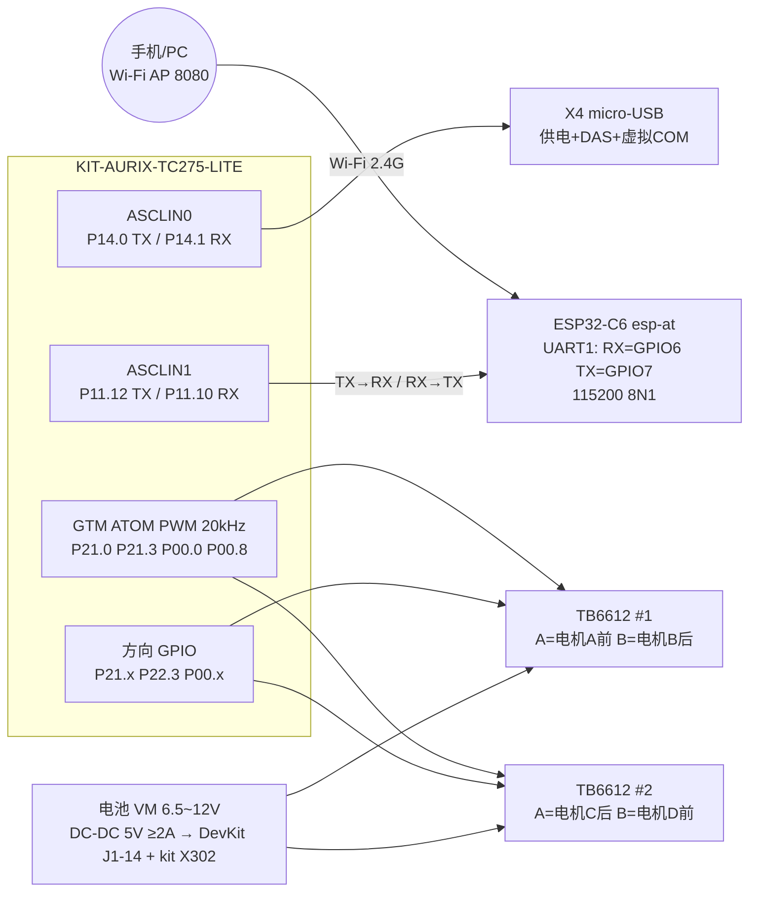

# AURIX SmartDrive 接线图（TC275 + ESP32-C6 + 2×TB6612）

版本：V1.1（Wi-Fi 模块由 ESP8266 更换为 ESP32-C6，运行 esp-at AT 固件）

配套文档：requirement.md（产品需求 V1.1，第 5 章为 ESP32-C6 AT 设计）

ESP32-C6 固件工程：`C:\Code\TC275\AURIX-v1.10.36-workspace\esp-at`（target = esp32c6，配置 module_esp32c6_default）

ESP32-C6 硬件板卡：**ESP32-C6-DevKitC-1 V1.2**（ESP32-C6-WROOM-1/-1U 模组，8 MB flash，板载 5V→3.3V LDO、USB-UART 桥 + 原生 USB 双 Type-C 口、BOOT/RST 按键、GPIO8 地址彩灯）

参考资料：[ESP32-C6-DevKitC-1 v1.2 User Guide](https://docs.espressif.com/projects/esp-dev-kits/en/latest/esp32c6/esp32-c6-devkitc-1/user_guide.html)

---

## 1. 系统总接线图

```
                        ┌──────────────────────────────┐
                        │   KIT-AURIX-TC275-LITE       │
  X4 micro-USB ────────►│  供电+DAS调试+虚拟COM         │
  (接PC, 一根线三件事)   │  ASCLIN0 P14.0/P14.1 板内互连 │
                        │                              │
  ESP32-C6-DevKitC-1    │  ASCLIN1                     │
  ┌───────────────┐     │                              │
  │ GPIO7 TX ─────────► │ P11.10 RX (X1-34)            │
  │ GPIO6 RX ◄──────────│ P11.12 TX (X1-32)            │
  │ GND  ─────────────► │ GND (共地!)                   │
  │ 5V ◄── DC-DC 5V≥2A  │  (板载LDO出3.3V, 见§5)        │
  │ EN/RST 板载已处理    │                              │
  └───────────────┘     │  GTM PWM 20kHz    方向 GPIO   │
                        │  P21.0 P21.3      P21.2~5    │
     电池(2S~3S)         │  P00.0 P00.8      P00.x P22.3│
        │               └──────────┬──────────┬────────┘
        ├──► VM ──────────────────►│          │
        ├──► DC-DC 降压 5V ≥2A ──► 5V(DevKit J1-14) + kit X302    ▼          ▼
        │                        ┌──────────┐  ┌──────────┐
        └──► GND(全系统共地)      │ TB6612#1 │  │ TB6612#2 │
                                 │ A:电机A   │  │ A:电机C   │
                                 │ B:电机B   │  │ B:电机D   │
                                 └────┬─────┘  └────┬─────┘
                                      │AO1/AO2→电机A │AO1/AO2→电机C
                                      │(前轮)        │(后轮)
                                      │BO1/BO2→电机B │BO1/BO2→电机D
                                      │(后轮)        │(前轮)
```

Mermaid 版（支持的查看器可渲染）：



---

## 2. TC275 ↔ ESP32-C6（核心变更点，替代原 ESP8266 接线）

ESP32-C6 esp-at 固件的 AT 通道是 **UART1**（不是 ESP8266 的 UART0），默认引脚如下（来自 esp-at `docs/en/Get_Started/Hardware_connection.rst` ESP32-C6 章节）。DevKitC-1 排针位置见官方 User Guide 引脚图（引脚号以板端丝印为准）：

| TC275 (LITE kit) | 方向 | ESP32-C6 (esp-at) | DevKitC-1 位置 | 说明 |
|---|---|---|---|---|
| P11.12（X1-32，ASCLIN1 TX） | → | GPIO6（UART1 RX） | J1-5 | 交叉连接；从 X1 排针 32 脚取 |
| P11.10（X1-34，ASCLIN1 RX，保持上拉） | ← | GPIO7（UART1 TX） | J1-6 | 交叉连接；从 X1 排针 34 脚取 |
| GND | — | GND | J1-15 | **必须共地** |
| — | — | 5V 供电 | J1-14（5V） | 车载 DC-DC 5V（与 kit 共用 ≥2A 轨），见 §5 |

> AT 串口用 ASCLIN1，引脚改到端口 11：TX=**P11.12（X1 第 32 脚）**、RX=**P11.10（X1 第 34 脚）**（iLLD 符号 `IfxAsclin1_TX_P11_12_OUT` / `IfxAsclin1_RXE_P11_10_IN`）。这两个脚在 X1 上未被板载电路复用。注意同段 X1 上印着 `RXD1/TXD0` 的 P11.9/P11.3 是片上以太网 MII 信号，**不是**串口，勿混用。

> J1-1 的 3V3 是板载 LDO 的**输出**脚：采用 5V 供电方案时请勿再从外部向 3V3 灌电。

可选 / 流控：

| TC275 | 方向 | ESP32-C6 (esp-at) | DevKitC-1 位置 | 说明 |
|---|---|---|---|---|
| （可不接） | ← | GPIO4（UART1 RTS） | J1-3 | esp-at 默认 RTS 流控开启，处理方式见下 |
| （可不接） | → | GPIO5（UART1 CTS） | J1-4 | |

> **流控注意**：`module_esp32c6_default` 的 `CONFIG_AT_UART_DEFAULT_FLOW_CONTROL=1`（RTS 使能）。两种解决办法任选其一：
> 1. TC275 初始化 AT 序列最前面补发 `AT+UART_CUR=115200,8,1,0,0`（关流控，运行时生效）；
> 2. 在 esp-at 编译时将该配置改为 0（编译期生效）。
> 若不处理，ESP32-C6 接收缓冲接近满时会通过 RTS 停发，而 TC275 不检查该信号，极端情况下会丢字节。

烧录 / 日志：**无需外接 USB-UART 线**。DevKitC-1 V1.2 板载两个 Type-C 口：

| 接口 | 内部连接 | 用途 |
|---|---|---|
| USB-to-UART 桥口 | 桥接芯片 → UART0（GPIO16/17），支持自动下载 | 烧录（`idf.py flash` / esptool）、esp-at 日志 |
| ESP32-C6 USB 口 | 原生 USB（D+=GPIO13、D-=GPIO12，经 J3） | USB-Serial-JTAG 烧录/控制台 |

手动进下载模式：按住 BOOT（GPIO9）→ 点按 RST → 松开 BOOT。正常运行时 GPIO9/GPIO8 保持板载状态即可。

板载资源速查（避免误用）：

| 板载器件 | 占用引脚 | 本项目注意事项 |
|---|---|---|
| BOOT 按键 | GPIO9（strapping） | 不接外部电路；上电为低会进下载模式 |
| 地址彩灯 | GPIO8（strapping） | 已占用，勿作普通 IO、勿外接下拉 |
| RST 按键 / RST 脚 | EN（J1-2） | 可选：后续由 TC275 GPIO 引出做硬件复位/急停扩展 |
| J5 电流测量跳线 | 3V3 供电路径 | 用板载 LDO 给模组供电时保持短接 |
| USB 选择 J3 | GPIO12/13 | 使用原生 USB 口时保持默认连接 |

---

## 3. TC275 ↔ TB6612 #1（电机 A / B，同侧轮，代码 motor.c）

TB6612 驱动板引脚 ↔ TC275：

| TB6612 #1 | TC275 引脚 | 功能 |
|---|---|---|
| PWMA | P21.0（GTM ATOM2_4 / TOUT51） | 电机A PWM，20 kHz |
| AIN1 | P21.4 | 电机A 方向 1 |
| AIN2 | P21.5 | 电机A 方向 2 |
| PWMB | P21.3（GTM ATOM4_1 / TOUT54） | 电机B PWM，20 kHz |
| BIN1 | P21.2 | 电机B 方向 1 |
| BIN2 | P22.3 | 电机B 方向 2 |
| STBY | 3.3V（常使能） | 后续可改 GPIO 做硬件急停 |
| AO1/AO2 | 电机A（同侧前轮） | |
| BO1/BO2 | 电机B（同侧后轮） | |

## 4. TC275 ↔ TB6612 #2（电机 C / D，另一侧轮）

| TB6612 #2 | TC275 引脚 | 功能 |
|---|---|---|
| PWMA | P00.0（GTM ATOM1_0 / TOUT9） | 电机C PWM，20 kHz |
| AIN1 | P00.2 | 电机C 方向 1 |
| AIN2 | P00.6 | 电机C 方向 2 |
| PWMB | P00.8（GTM ATOM0_7 / TOUT17） | 电机D PWM，20 kHz |
| BIN1 | P00.10 | 电机D 方向 1 |
| BIN2 | P00.12 | 电机D 方向 2 |
| STBY | 3.3V | |
| AO1/AO2 | 电机C（后轮） | |
| BO1/BO2 | 电机D（前轮） | |

> 电机 B、C 在软件中做了方向翻转（motor.c `g_dirInvert`），接线按本表即可，无需交换电机线。

## 5. 电源与接地

### 5.1 整车供电架构

```
电池(2S~3S, TB6612 VM 建议 6.5~12V)
 ├──► TB6612 #1/#2 VM（电机电源，粗线）
 ├──► DC-DC 降压 5V ≥2A ──┬──► TC275 LITE kit  X302(+5V)（见 §5.2）
 │                        └──► ESP32-C6-DevKitC-1 J1-14(5V)
 │                              └─ 板载 5V→3.3V LDO 给模组供电（J5 跳线保持短接）
 └──► GND（全系统共地）

TB6612 VCC(逻辑) → 3.3V，可从 TC275 kit X1-2(VEXT) 取（见 §5.2 电流预算）
```

### 5.2 TC275 LITE kit 供电详解（依据官方 User Manual V1.1 §2.1）

板载电源结构：输入 5V → **LDO G1** 产生 3.3V（板上称 **VEXT**，最大输出 1A）；绿色电源指示灯 **D5** 亮表示 3.3V 正常。另有一路 **VDD_USB**（X4 的 VBUS）。

官方提供 4 种供电方式，**同一时刻只允许一种**：

| 方式 | 入口 | 说明 |
|---|---|---|
| ① USB（桌面推荐） | **X4 micro-AB USB** 接 PC | 同时完成供电 + DAS 调试 + ASCLIN0 虚拟串口；USB2.0 口最多 500 mA，建议用 USB3.0 口（900 mA）或带高电流供电能力的外部 USB 电源 |
| ② 车载 5V（本项目采用） | **X302 Arduino 电源排针的 +5V 脚** | 来自 DC-DC 5V ≥2A（与 C6 共用一路） |
| ③ 车载 5V（备用入口） | **X1-39 或 X2-2 的 VDD_USB 脚** | 与 ② 等效 |
| ④ 外部 3.3V 直灌（特殊场景） | **X1-2 / X2-39 的 VEXT 脚** 或 X302 +3V3 脚 | 必须先**拆掉电阻 R27**（0Ω，0805）；副作用：**CAN 收发器失效**（TLE9251 需要 5V）。本项目不用 |

硬性警告（手册原文要点）：

- **X4 插着 USB 时，禁止**再从 ②③④ 任何电源脚输入电压——板上**没有反向电流保护**，会倒灌损坏 USB 主机/PC；反过来用车载 5V 上电时，也不要再把 X4 接到 PC（调试时拔掉 X4 或只保证二者不同时带电，DAS 调试需 X4 时须先断开车载 5V 的判断交给使用者，官方明确要求“ensure X4 is not supplied by any power source or PC”用于方式②③④）。
- 禁止多个电源脚同时施加电源，否则可能烧毁板子。
- **VEXT 就是 LDO G1 的输出轨**：向其灌电压会直接损坏 LDO（方式④拆 R27 是唯一合法例外）。
- 板卡逻辑电平为 **3.3V，不兼容 5V 电平外设**（官方手册 §3.3 明确）。

电流预算（LDO G1 上限 1A）：

| 负载 | 典型电流 |
|---|---|
| TC275 + FT2232（板载） | ~200–300 mA |
| TB6612 ×2 的 VCC（仅逻辑，STBY 同接） | < 30 mA |
| 余量给扩展 | ~700 mA |

> 结论：TB6612 逻辑 VCC 从 X1-2(VEXT) 取是安全的；**电机功率一律走 VM**，绝不允许从 3.3V 轨取。ESP32-C6 **不要**从 kit 取电（它自己 5V→板载 LDO 独立供电），避免把 C6 的开关噪声和 1A 预算冲突压到 LDO G1 上。

### 5.3 ESP32-C6-DevKitC-1 供电要点

- 推荐从车载 DC-DC 的 **5V** 接入 J1-14（单板最低 ≥1A；与 TC275 kit 共用一路时整轨 ≥2A，见 §5.1），由板载 LDO 产生 3.3V 供模组；Wi-Fi 发射瞬时电流峰值 ~350–500 mA，5V 轨裕量不足会导致 Brownout 复位。
- 5V 入水口旁加 **≥470 µF 大电容 + 0.1 µF**；远离电机驱动走线，星型接地，避免电机电流纹波耦合。
- 也可用独立 3.3V ≥1A LDO 接 J1-1(3V3)，但此时须断开板载 LDO 供电路径（拔 J5 跳线），二选一，**禁止两路 3.3V 并联通电**。
- 调试阶段可临时用 PC USB 给 DevKitC-1 供电，但电机全速运行时 USB 供电电流不足，必须切换为车载 5V。

### 5.4 接地与上电顺序

```
全系统共地：电池负极 = TB6612 GND = kit X1-40/X2-40(GND) = DevKitC-1 GND(J1-15)
上电顺序：先整车 DC-DC 5V（逻辑上电）→ 电池 VM（动力）；断电顺序相反。
电机线、编码器线(将来)远离 C6 天线端（WROOM-1 板载天线在 J1 对侧），减少扰动。
```

## 6. 调试串口（TC275 侧，免外接 USB-UART）

kit 板载 **FT2232HL**，X4 micro-USB 一根线三件事：供电（桌面）、DAS 下载调试、**虚拟 COM 口**。

| PC 侧 | 内部连接 | 说明 |
|---|---|---|
| 虚拟 COM 口 TX/RX | FT2232 ⇄ **P14.0 / P14.1（ASCLIN0）** | 115200 8N1，本工程日志/回显通道 |

> P14.0/P14.1 **没有**引到任何外接排针（X1/X2/mikroBUS/Shield2Go/Arduino 均无），想脱离 X4 用外接 USB-UART 接 ASCLIN0 是做不到的；改用其他 ASCLIN 或走板载 DAP 10 针调试口另议。

## 7. 与原 ESP8266 方案的差异摘要

| 项 | ESP8266（旧） | ESP32-C6 esp-at（新） |
|---|---|---|
| AT 串口 | UART0（TX=GPIO1/RX=GPIO3） | **UART1（TX=GPIO7/RX=GPIO6）** |
| 下载/烧录 | UART0 复用，需外接 USB-UART | 板载双 Type-C（USB-UART 桥 + 原生 USB），免外接 |
| 波特率 | 115200 | 115200（不变） |
| AT 指令集 | 原生 | 兼容（CWMODE/CWSAP/CIPMUX/CIPSERVER/CIPSEND/+IPD/CIPCLOSE 均可用） |
| 流控 | 无 | 默认 RTS 使能，需按 §2 关闭或接线 |
| 供电 | 3.3V ≥500mA | DevKitC-1 车载 5V（板载 LDO），与 kit 共用 ≥2A 轨，见 §5 |
| 特有功能 | — | BLE 5 / 802.15.4 / Wi-Fi 6 TWT，为 V2.0 后扩展留余地 |
| TC275 侧引脚 | P15.0/P15.1（旧） | **改为 P11.12（TX）/ P11.10（RX），X1 排针 32/34 脚** |
