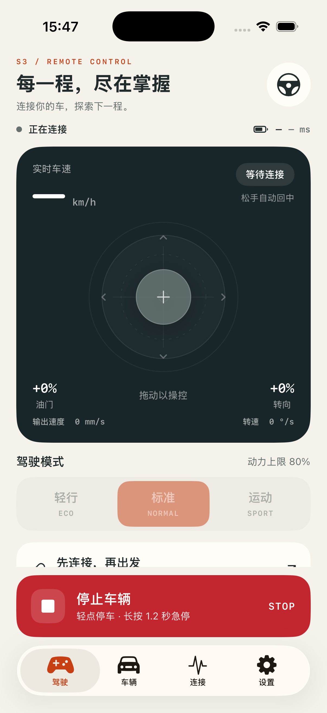
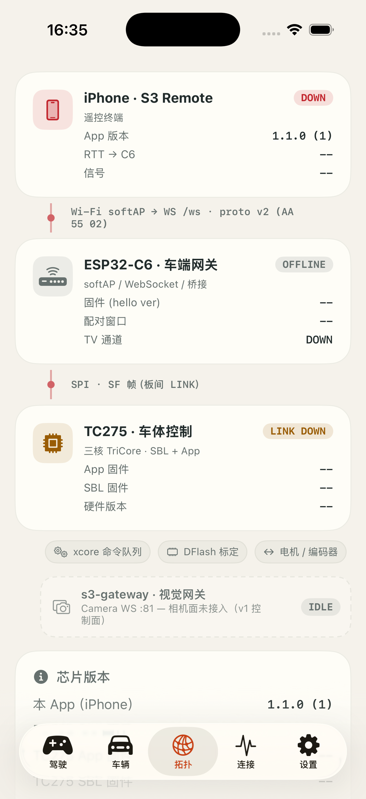

# ios_remote — S3 Remote iOS App（iPhone 遥控器）

用 Swift/SwiftUI 在 iPhone 上复刻 [`smartcar_remote`](../smartcar_remote)
（ESP32-S3 LCD 硬件遥控器）的核心功能：经 C6 softAP + WebSocket 以 proto v2
协议驾驶车辆、显示遥测、配对、诊断与安全告警。**不要求 C6 / TC275 /
s3-gateway 做任何改动**——与 S3 遥控器、手机 Web 页共用同一套车端接口。

```
iPhone (本 App) ──Wi-Fi STA→ C6 softAP ──WebSocket /ws── proto v2 + JSON 文本面
S3 遥控器      ──同上（同构客户端）
C6 ──SPI/SF帧── TC275 ── 车辆
```

## UI（精密遥控台）

暖白背景、深墨色操控台、陶橙色交互重点。驾驶页将实时速度、摇杆和输入反馈
收进一个操控区；驾驶模式用中文命名，停止按钮固定在底部，滚动页面时仍可触达。
连接、配对与异常提示使用中文，未连接时可从驾驶页直达连接设置。
车辆、连接中心、设置使用统一的标题层级与轻量卡片。

- 摇杆：上/下对应前进/后退，左/右对应转向；离开驾驶页或失去控制权时归零。
- 停止：轻点锁存停车，长按 1.2 秒触发急停；支持 VoiceOver 停车和急停操作。
- 车辆：遥测过期后隐藏旧读数；电池告警仍由实际遥测驱动。
- 配对凭证：token 持久化在 Keychain（v1.3 起不再写入 UserDefaults），
  网关地址支持 IP 或主机名。
- Logo 仪表环：驾驶页头部双圆弧围绕标志——外圈电量、内圈信号
  （iOS 主屏电池小组件风格），档位配色与全 App 信号/电量语义一致。
- 相机：驾驶页实时画面卡（s3-gateway MJPEG），单查看者礼让，
  离开驾驶页/退后台自动让位；拓扑页网关节点实时点亮。
- 玩法：特技动作一键执行，体感驾驶开启后摇杆让位，STOP/急停随时中止一切。




开发参数：`--tab 0..7` 指定初始页，`--no-alert` 抑制告警覆盖层，
`--no-onboard` 跳过首启引导（用于截图/联调）。
截图为模拟器未连接状态，不代表实车联调结果。

## 功能对照（固件模块 → iOS 实现）

| S3 遥控器（固件） | iOS（本工程） | 说明 |
|---|---|---|
| `proto/proto_frames.[ch]` | `S3Remote/Proto/Proto.swift` | CRC16-CCITT-FALSE、帧编解码、逐字节解析状态机（AA AA 55 容错/VER/FMT/CRC 错误分类），黄金向量与 C 实现字节级对齐 |
| 0x41 遥测 38 B LE | `S3Remote/Proto/Telemetry.swift` | 全字段解析 + `v1.5.0` 固件版本格式化 |
| `scr_link.c`（WS/JSON 面板） | `S3Remote/Link/LinkEngine.swift` + `Link/TextMessage.swift` | `hello{role,ver,tc,pair,ctrl}` 角色判定、`tc{on}`、1 Hz `{"t":"ping"}`→`pong` RTT、`err{auth}` 控制权失效、静默 10 s 看门狗强连、3 s 失败退避 |
| `POST /api/pair` 配对 | `LinkEngine.pair()` | 403/409/504/503 → 可动作的中文提示（doc/04 §4 口径），成功后存 token 并重连 |
| `scr_ctrl.c` 30 Hz 控制 | `S3Remote/Control/DriveController.swift` | 闸门（连接+CTRL）、ECO/NORMAL/SPORT 50/80/100 % 限幅、满行程 v=600 mm/s / ω=300 °/s、零位心跳、STOP 单击锁存、长按 1.2 s 急停 0x32 + 双锁存、RELEASE 后保持停止、控制权丢失冻结 |
| `safety_watch` | `S3Remote/Control/SafetyMonitor.swift` | 失联 1.2 s 去抖全屏告警 + 恢复事件、故障码、低电 20 %/临界 10 % + 5 % 回差 |
| 遥测丢包统计（spec 28） | `S3Remote/Control/TelemetryLossCounter.swift` | seq 缺口 Δ∈(1,1000) 记 Δ−1，loss ‰ |
| 电池显示防抖（C6 cee1189） | `S3Remote/Control/BatteryDisplayFilter.swift` | 电压：5 点中值 + 500 ms EMA + ≤2 Hz 显示闸 + 20 mV 下降/50 mV 上升双向迟滞；电量：5 点中值 + 持续 1.5 s 下降确认 + 持续 10 s ≥+2 % 回升确认（充电后步进回 100 %）；遥测 uptime 回退（整车重启，即充电断电重开）时双平面重置重播种；重连不解除、零电压视为未就绪；告警/颜色仍用真实遥测 |
| 车速表 EMA 平滑（C6 renderSpeed） | `S3Remote/Control/SpeedDisplayFilter.swift` | 驾驶页大字：dt 感知 EMA（τ=150 ms）+ 首帧/断流 >400 ms/进出静止（<30 mm/s）吸附，1 位小数、静止读 0.0；轨迹/纪录/安全仍用原始遥测 |
| 相机面（s3-gateway :81） | `S3Remote/Camera/CameraClient.swift` + `UI/CameraView.swift` | MJPEG `GET :81/stream`（multipart 按 Content-Length 切帧）；单查看者礼让、4 s 短超时 + 0.8→4 s 退避重连、2 s 帧停滞自愈；503"被占用"态；设置独立开关/地址 |
| 配对凭证 | `S3Remote/Security/TokenStore.swift` | token 存 Keychain（GenericPassword）；首启从 v1.2 UserDefaults blob 自动迁移并剔除；运行时经 `AppState.setToken` 双层同步 |
| 拓扑/芯片版本 | `S3Remote/UI/TopologyView.swift` + AppState `tcAppVer/tcSblVer` | tcver 信标（{"t":"tcver","app","sbl"}）、hello ver、遥测 fw_ver/hw_rev/link_rtt/link_err——零固件改动；s3-gateway 相机面为虚线占位（v1 控制面） |
| 信号强度 | `S3Remote/Control/LinkQuality.swift` + UI `SignalBarsView` | 两级：网关在 hello 带可选 `rssi` 字段或周期发 `{"t":"rssi","dbm":N}` 时显示真实 dBm（分档与 S3 遥控器 Kconfig 同源：−60/−67/−75/−85）；否则用 RTT+遥测丢包合成 4 格预估（UI 标注"预估 · x"）。状态舱与诊断页常驻显示 |
| `app_state.c` | `S3Remote/Model/AppState.swift` | UI 单一事实源、600 ms 遥测过期（"--"）、事件环形日志、快照式发布 |
| TC275 DPT 标定协议 0x70~0x74（esp32c6_car doc/17 / tc275_car doc/34 同源契约） | `S3Remote/Control/CalibSession.swift` + `UI/CalibView.swift` | 判向标定/逐电机点动/记录读写三族命令 + `cal`/`rec`/`jogcnt` JSON 回执解析；载荷逐字节对齐 `calib_record.c`（jog 钳 ±500、REC_SET 12 B），见下方「台架标定」 |
| LVGL P1/P2/P4/P5/P9 | `S3Remote/UI/*.swift` | Home（摇杆/大速度/STOP）、Vehicle、Diag（统计+配对+事件日志）、Settings、全屏告警覆盖层（急停 RELEASE / 失联自动清除 / 其余 ACK） |
| —（App 侧玩法，零固件改动） | `Control/StuntSequencer.swift` 等 | 详见下方「玩法功能」 |

## 玩法功能（v1.2.0，全部纯 App 侧实现）

- **特技动作库**（`Control/StuntSequencer.swift` + 玩法页）：8 个预设动作
  （原地左/右旋、8 字巡航、S 形绕桩、弹射起步、漂移甩尾、舞蹈串烧、往返冲刺），
  关键帧线性插值经 30 Hz 控制流走摇杆同一条 DRIVE 通道——模式限幅、STOP、
  急停、失联、退后台全部即时中止；再次点击执行中的卡片也可中止。
- **体感驾驶**（`Control/TiltDriver.swift` + `Motion/MotionSource.swift`）：
  CoreMotion 重力矢量映射，前倾=油门、左右倾斜=转向；死区 + expo 曲线 +
  灵敏度可调 + 一键水平校准；驾驶页气泡姿态指示，开启后摇杆让位，STOP 锁存
  时体感条上有"继续"恢复入口。
- **实时轨迹**（`Control/OdometryTracker.swift`）：由左右轮实测速度做差速
  航位推算（ω=(vR−vL)/轮距），Canvas 实时绘制、最近段高亮、点位上限 1500
  自动抽稀、遥测断流 >2 s 自动重画；轮距（mm）设置可调。
- **竞速与纪录**（`Control/RecordsTracker.swift`）：圈速秒表（开始/打圈/结束/
  重置 + 最近圈列表）与纪录墙（极速/单程最远/最快圈速），UserDefaults 持久化。
- **音效包**（`Audio/SoundEngine.swift`）：AVAudioEngine 实时合成引擎嗡鸣
  （音高随实际输出速度）、双音喇叭、特技启动音；ambient 会话尊重静音键，
  设置默认关闭。
- **摇杆转向修复**：`JoystickInput` 此前右推给出 w>0，而固件混控约定
  w>0 为左转（C6 Web 页 joyW=−dx 同源）——实际驾驶中推右会左转；已修正
  并补回归测试。

## 台架标定（TC275 DPT 0x70~0x74）

「标定」Tab 是 TC275 编码器判向标定协议的手机端入口，与 C6 Web 标定页
`/calib.html` 消费同一条 WS 链路与同一份回执（`{"t":"cal"}` / `{"t":"rec"}` /
`{"t":"jogcnt"}`），按标定流程分四步：

1. **① 安全前提**：WS 已连接、CTRL 角色、TC275 在线、四轮离地确认（断线自动
   重置确认）；缺项实时显示在标题右侧；
2. **② 编码器判向**：二次确认后一次发一帧 0x70（每轮 250 ms 脉冲约 1.4 s），
   3 s 回执窗口内防连点；超窗只显示"保存状态待确认"，DFlash 等静止/重试的
   迟到回执仍会更新结果表；`delta==0` 标红"查接线"，`invert=-1` 标"已翻转"，
   `saved` 显示落库结论（1 已写 / 2 写失败 / 缺失待确认）；
3. **③ 点动复核**：四通道"按住即转"（30 Hz 发 0x71 `{motor, duty ±500}`，
   松手补零帧，固件 300 ms 超时兜底），俯视图高亮点动轮并显示编码器计数
   增量；故障锁存（新鲜遥测 fault≠0）、急停、STOP、判定窗口任一命中即禁用；
4. **④ 生效参数与持久化**：进入页面自动 REC_GET 回读（ver/src/pos/invert/
   fullScale/轮径/crcOk），可编辑 fullScale（100..5000）、轮径（30..200）与
   四通道位置（必须唯一）发 REC_SET，或 REC_CLEAR 擦除回默认；"与最近一次
   标定一致/不一致"判据逐轮比对 0x23 与 0x22 的 invert（落库证据）。

安全互锁（doc 17 §2.3/§8.1 同源）：标定运行窗口与点动期间驾驶发送钳零防
突跳（TC275 侧优先级 急停 > 标定 > jog > 伺服）；STOP 任何状态可用；离开
标定页/退后台自动停点动。

## 页面

- **驾驶**：状态栏（连接/角色/TC/电量/RTT）、实时画面卡（相机开启时）、
  大速度、虚拟摇杆（死区可配、回弹）、T/S 与"实际发出"值、模式限幅、
  体感驾驶开关（气泡姿态指示 + 校准 + 继续入口）、
  喇叭（音效开启时显示）、STOP（单击停止锁存 / 长按 1.2 s 急停，带进度提示）。
- **玩法**：特技动作网格（执行中显示进度、再点中止）、实时轨迹 Canvas
  （自动缩放/最近段高亮/快照分享/清除）、圈速挑战（秒表 + 打圈 + 最佳圈标冠）、
  纪录墙（极速/单程最远/最快圈速，可清空）。
- **车辆**：电池 SOC/电压、左右目标/实测速度、本次/总里程、任务状态、故障码
  （中文描述）、运行时间、C6/TC275 固件版本。
- **传感器**：页内分 **IMU 姿态** 与 **ToF 测距** 两个独立界面。IMU 界面的
  整宽 3D 车体显示相对旋转、横滚与俯仰。车端轴向未标定时，使用原始 IMU
  姿态预览并标出传感器坐标；固定比例车模与地面参照使转动清楚可见。
  页面可在水平放置及抬起车头两种静止姿势下采样，推算右手车体系轴向，
  输入实测轮距后通过 DPT 0x7A 写入 TC275，等待 EVT 0x23 的 DFlash 保存结果。
  iOS 同时保存轴向用于写入前的显示预览；车端 flags bit3 确认后显示融合姿态。
  倾角卡只在车端融合标定后标出 ±45° 保护线，水平加速度球
  展示前后/左右方向与峰值，六轴原始值及波形保留单位。ToF 界面的区域图
  由 `tofz` 三片重组；丢片时只绘制已收到的区域并标注 `1/3`
  或 `2/3`，灰格不臆造距离。若区域分片全未到达但融合状态新鲜且 ToF
  健康，最近距离改显示融合摘要，并明确标注其来源。区域图和融合摘要
  均不可用时显示等待状态，不把无效区域当障碍。
- **拓扑**：整车网络拓扑（iPhone → Wi-Fi/WS proto v2 → C6 → SPI/SF 帧 → TC275，
  外设芯片），链路状态实时点亮；s3-gateway 相机节点随开关/连接状态点亮
  （LIVE/CONNECTING/BUSY）；**芯片版本清单**：本 App / C6 固件（hello ver）/
  TC275 App（tcver/遥测 fw_ver）/ TC275 SBL（tcver）/ 硬件 rev。
- **连接**：TX/RX 帧率、遥测丢包 ‰、RTT last/min/max、配对按钮与结果、
  事件日志（可一键分享/复制导出）。
- **设置**：网关地址（默认 192.168.4.1）、token、摇杆死区、默认模式、
  驾驶辅助提示开关、音效开关、轨迹轮距、体感灵敏度、相机开关与地址、
  新手引导重看、应用并重连。
- **标定**：TC275 台架标定四步流程（见上方「台架标定」章节）。
- **首启引导**：三步 onboarding（加 Wi-Fi → 长按配对键 → PAIR 取控），
  可跳过、可从设置重看。

## 构建与运行

要求 Xcode 26+（Swift 6），iOS 17.0+ 真机或模拟器：

```bash
open ios_remote/S3Remote.xcodeproj      # Cmd+R 运行（scheme 由 Xcode 自动创建）
# 命令行
xcodebuild -project ios_remote/S3Remote.xcodeproj -scheme S3Remote \
  -destination 'platform=iOS Simulator,name=iPhone 17 Pro' build
xcodebuild -project ios_remote/S3Remote.xcodeproj -scheme S3Remote \
  -destination 'platform=iOS Simulator,name=iPhone 17 Pro' test   # 170 项单测（含标定协议/摇杆坐标映射回归）
```

工程无第三方依赖；`project.pbxproj` 为 Xcode 16+ 文件系统同步组格式，新增
Swift 文件放进 `S3Remote/` 或 `S3RemoteTests/` 目录即自动入编。

> 手写 `.xcscheme` 的 BuildableReference 必须带 `BuildableIdentifier="primary"`，
> 缺失会让 Xcode 26 解析时直接崩溃（`IDEScheme schemeFromXMLData` SIGTRAP，
> 本仓库开发时踩过，现已入库修正版共享 scheme `xcshareddata/xcschemes/`，
> CLI `-scheme` 行为确定）。

## 版本管理与 CI

- **版本真源**：`S3Remote.xcodeproj/project.pbxproj` 的 `MARKETING_VERSION`
  （构建号 `CURRENT_PROJECT_VERSION` 随包不随版）。App 关于页读 Bundle 信息，
  升版只有一处改动：

  ```bash
  just ios-version v1.2.0    # 改 MARKETING_VERSION → 同步写 ios_remote/CHANGELOG.md → 提交
  just tag ios v1.2.0        # 建 tag ios/v1.2.0（同固件工程口径）
  git push origin ios/v1.2.0 # 触发 Release workflow
  ```

- **CI 门控**（`.github/workflows/ios-remote.yml`）：push/PR 触及 `ios_remote/**`
  即在 macOS runner 跑全部 Swift 单测；发版不受未测代码污染——
  `ios-remote-release.yml`（tag `ios/v*` 触发）先复用该 CI 再建 GitHub Release。
- **发版产物**：与 tc275 同口径不附二进制（签名证书绑定开发机，runner 产不出
  可安装包），从 tag 自行 `just ios-install`。
- 发版记录见 `CHANGELOG.md`（Keep a Changelog 格式）。

## 联调步骤

1. iPhone 加入 C6 softAP（台架默认 `SD-DEV000` / `sddev123456`），App 首次
   使用需允许"本地网络"权限（`NSLocalNetworkUsageDescription` 已配）。
2. 车侧长按配对键 3 s 开窗 → 诊断页 **PAIR** → token 自动保存并重连取得 CTRL
   （与 S3 遥控器同口径；手机 Web 是备用端，不抢占）。
3. 摇杆驾驶；**STOP 单击**立即停车锁存，**长按 1.2 s** 发 0x32 急停并全屏锁定，
   按 RELEASE 后仍需触摸摇杆才恢复运动（spec 105）。
4. 失联/故障/低电按等级全屏告警；链路断开即停发 DRIVE，TC275 心跳看门狗自行停车。

## 已知限制

- **相机面为 MJPEG 直连**：走 `:81/stream`（真机验证路径）；WS `:81/ws/camera`
  的逐帧 SEQ/丢帧统计与主动控档位（REMOTE/WEB_PREVIEW）为二期，待网关 WS
  路径真机验证闭环。相机地址默认跟随控制网关，独立 softAP 部署时在设置里单独填。
- **信号强度为预估**：iOS 公开 API 拿不到 Wi-Fi RSSI，App 用 RTT + 遥测丢包
  合成 4 格信号条（标注"预估"）；若 C6 在 hello 中附加 `"rssi":<dBm>` 字段或
  周期广播 `{"t":"rssi","dbm":N}`（softAP 侧 `esp_wifi_ap_get_sta_list()` 一行
  即可取到），App 自动切换为真实 dBm 显示，无需改动 App。
- token 持久化已迁 Keychain（v1.3）；Keychain 在卸载重装后可能保留旧 token，
  用「重置配对」清理。
- App 退后台 WebSocket 即断，回前台由看门狗自动重连；驾驶请保持前台
  （退后台会自动中止特技/体感/相机并静音）。
- 限幅比/死区/电池阈值为台架默认值，与固件同源（Kconfig 默认），**须实车标定**。
- 轨迹为轮速航位推算（dead reckoning）：轮距默认 150 mm 需按实车微调，
  打滑/非对称地面会累积漂移，仅供玩法可视化、不用于导航。
- 体感方向基于竖屏握持假设（前倾=前进）；姿态异常时先点"校准"。
# 驾驶辅助状态（2026-10-04）

首页接收 C6 的 `fusion` JSON，显示近障停车、松杆恢复、测距过期及覆盖不足限速提示。覆盖不足时车端仅允许 150 mm/s（0.54 km/h）前进；250 mm/s（0.9 km/h）倒车上限仍由车端执行。提示不改变急停和驾驶心跳。原生 App 修改需在 macOS/Xcode 构建安装；当前 Windows 环境无法运行 SwiftUI/XCTest 或安装 iPhone App。

驾驶页摇杆上方的提示横幅（前进限速/近障/测距过期）可在 **设置 → 操控 → 驾驶辅助提示** 关闭（2026-10-05）：开关只影响显示，车端保护与事件日志不受影响。
